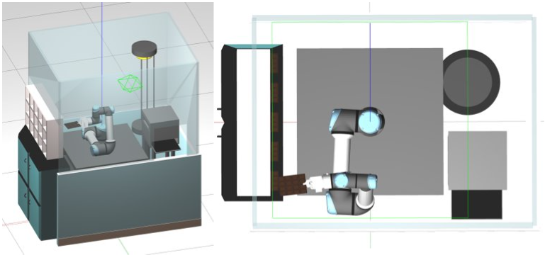

# RPC-Portioning-Line

### Purpose of this packadge
The aim of this project is to simulate a typical industrial task for a robot manipulator in the ROS environment. In particular we implemented a pick and place task using a UR5e manipulator, with a mlp3240 gripper mounted on it.

<p align="center">
  
</p>

For all datails, see https://github.com/DenisTognolo/RPC-Portioning-Line/blob/master/docs/report.pdf.

### Download this packadge
You can simply download this packadge using the following command, typing it inside your bash.

```bash
git clone https://github.com/DenisTognolo/RPC-Portioning-Line.git
```

### Source the 3D models
To proper import the 3D models you have to source the folder into the GAZEBO_MODEL_PATH variable using the following command:

```bash
export GAZEBO_MODEL_PATH=$GAZEBO_MODEL_PATH:<your_path>/RPC-Portioning-Line/models/dae
```
You can simply type it in your bash or paste it in your .bashrc file.

### Initial setup
First thing to do in order to use this packadge is to move inside the correct folder, and you can use the he following command:
```bash
cd RPC-Portioning-Line/ws
```
Then you also have to source the devel folder, in which you can find all executable files of this packadge, using the following command: 
```bash
. devel/setup.bash
```
If this command failed you probably need to create the executable files, so you need to compile them using he following command: 
```bash
catkin_make
```
This is also necessary in case you modify the code, in order to update the executable files. 

### Run the simulation
In order to run the simulation you can use one of the following commands:
```bash
roslaunch ur5e_mlp3240_moveit_config portioning_line.launch
roslaunch ur5e_mlp3240_moveit_config portioning_line_rviz.launch
```
Both of them launch the simulation in Gazebo, but the second one will also launch it in RVIZ, that can be used to try new planning approach or see collision objects during the task.

### Run the simulation
In order to run the task and actually move the robot you have to type, on another terminal, the following command:
```bash
rosrun ur5e_mlp3240_task pick_and_place _code:=XX
```
Where XX is the code of the desired chocolate bar (ex: A1, A1, ... ,A5, ... ,C5).

### TODO List:
* Due to lack of information about geometry and mass of each mlp3240 links the inertias, you can find inside src/mlp3240/urdf/mlp3240.xacro, are not the real ones.
